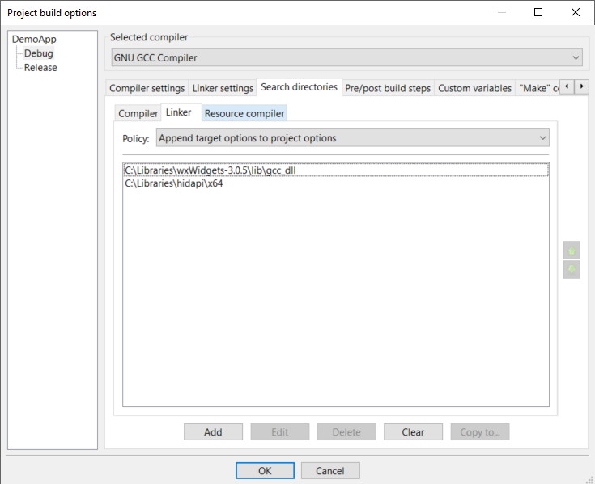

# C++ Host Demo

Here we have got some host demos on USB-Userport usage.
All this stuff relies on 3rd party tools.
It is made from
[wxWidgets 3.0.5](https://www.wxwidgets.org/),
[hidapi 0.11.0](https://github.com/libusb/hidapi)
and using
[Code::Blocks 20.03](https://www.codeblocks.org/)
as the development API (hence the .cbp file).

Since the setup of the C::B environment is a little bit delicate you
find here some description how mine is done.


## Code::Blocks (Part 1)

This is the easiest part.
I just downloaded the full installer - with minGW and GCC included.
The thing goes straight into `C:\program files\CodeBlocks`
(my computer runs Win10).
Follow the C::B installation guide thoroughly.

A first fast and quick console demo can get build to see if everything works.

When it comes to GUI programming I like the idea of wxWindows; which now is
called wxWidgets.


## wxWidgets

wxWidgets comes as plain source or precompiled library files.
After lots of reading about libraries, DLLs and what is necessary to make them
work, I decided to compile the whole wxWidgets from source with the minGW of
Code::Blocks.
My first attempt has been wxWidgets 3.1.5 but this refuses with some strange
error message.
The very next attempt (and with pretty much the same `make` command) I did with
3.0.5 and here it worked out - taking roughly 40 minutes on my machine.

Since there are severe warnings on "do not use locations with white space in
paths" the wxWidgets source went to `C:\Libraries\wxwidgets-3.0.5`, following
the guidelines on "installation".

When it comes to compile the wxWidgets into a DLL for Win10, I ran into trouble
with the PATH variable and my already installed AVR-GCC.
Because of this the procedure to me is a bit different than the official
wxWidgets guideline on compiling the lib. This is mine:
````
1.) Open windows command line ("DOS-Box").
2.) Change to the %root%\wxwidgets\build\msw directory
    e. g.: cd c:\Libraries\wxwidgets-3.0.5\build\msw
3.) Set the PATH (environment for this sole DOS-Box) exclusively to the GCC:
    e. g.: SET PATH=C:\Program Files\CodeBlocks\MinGW\bin
4.) Clean up relicts (from previous attempts)
    mingw32-make -f makefile.gcc MONOLITHIC=1 SHARED=1 UNICODE=1 BUILD=release clean
5.) And finally start he compilation (takes quite a while ...)
    mingw32-make -f makefile.gcc MONOLITHIC=1 SHARED=1 UNICODE=1 BUILD=release
````
This is how the DLL is build.
It is then found at `C:\Libraries\wxWidgets-3.0.5\lib\gcc_dll`.  
Pro: Several applications can share just this lib and thus save on code size.  
Con: Every application delivery must be bundled with the DLL.

For Release purposes the DLL approach is quite fine.
BTW: Even a debug build of the application does not need a debug build of
the wxWidgets.
Just a wxWidgets release build is what we want here.

But I dislike the aspect for deliveries to consist of more than just one file
to get it run.
For this reason I voted for a second wxWidgets library dedicated to static
linking.
Getting it is not too complicated and takes just another 40 minutes.
````
1.) Open windows command line ("DOS-Box").
2.) Change to the %root%\wxwidgets\build\msw directory
    e. g.: cd c:\Libraries\wxwidgets-3.0.5\build\msw
3.) Set the PATH (environment for this sole DOS-Box) exclusively to the GCC:
    e. g.: SET PATH=C:\Program Files\CodeBlocks\MinGW\bin
4.) Clean up relicts (from previous attempts)
    mingw32-make -f makefile.gcc MONOLITHIC=1 SHARED=0 UNICODE=1 BUILD=release clean
5.) And finally start he compilation (takes quite a while ...)
    mingw32-make -f makefile.gcc MONOLITHIC=1 SHARED=0 UNICODE=1 BUILD=release
````
The only difference to the above DLL version is the setting of the `SHARED`
parameter.
The linker finds the static library at `C:\Libraries\wxWidgets-3.0.5\lib\gcc_lib`
when it comes to release builds.  
Pro: Single .exe file, just run on any Win(10) machine.  
Con: Larger file size.  


## hidapi

Connection to the USB-Userport is made via the USB HID class.
To not reinvent the wheel I voted for the hidapi and "installed" it also on
my machine.
It resides at `C:\Libraries\hidapi`, more specific I fetched the ready made
windows bundle with all necessary files - except the hidapi.h!
Because of the missing hidapi.h I also fetched the complete source archive and
extracted the hidapi.h.
The whole structure now is
````
C:/
   Libraries/
      wxWidgets-3.0.5/
         ...
      hidapi/
         hidapi.h
         x86/
            hidapi.dll
            hidapi.lib
            hidapi.pdb
         x64/
            hidapi.dll
            hidapi.lib
            hidapi.pdb
         windows/
            hidapi.c
````
If you run another OS, then you need to adjust things here.
Maybe you want to use just static linking anytime and thus do not need the DLLs.
The `hidapi.c` is necessary only for static linking (and for those being curious
about how things work).
Take a look into the C source and compare things with the excel macros, it is
quite interesting to find out about their similarity.


## Code::Blocks (Part 2)

With the readily available wxWidgets library it is quite easy to use the project
wizard and get into a first sample GUI demo by just a few mouse clicks.
[Code::Blocks <=> wxWidgets](https://wiki.codeblocks.org/index.php/WxWindowsQuickRef)

Then it comes to the hidapi connection.
Reading a bit through "how to add a library to a C::B project" gave some idea
what to add and where to connect the C::B to the hidapi.
Some trial and error then brought it to work finally.
A very first "blinky LED" in addition to the "Hello World" then works like a
charme.
But be aware: If something on the paths is maladjusted the compiler or the
linker throw very misleading error messages.
Misleading because there are lots of threads around that explain lots of things
that my fail - aside the wrong path setting.

For those not needing fancy setups the next step will be to experiment with
the wxWidgets possibilities and write their own applications accessing the
USB-Userport hardware.

But I wanted to make the difference between Debug Build and Release Build.
The aim is to transfer just a single file to another (Win10) machine and have it
run there without admin privileges, installers or such annoying stuff. This is
for the release build. The debug stays local, normally.

Well, I had lots of hazzle and frustration until I had read enough web articles
to get enough background for tweaking the C::B project setup manually.
But now it is done and the sample .cbp file I share with you for your
convenience.
Always feel free to substitue your own.


### Still Images of the Setup

And here comes in addition the settings I took as still images.
Maybe a few settings are redundant or even scrap.
I found it does not matter if you take relative or absolute paths.
At least, it compiles and runs for me, both Debug and Release build.
The C::B screens not documented here, are left on their defaults.
Feel free to experiment with the settings.


#### Properties

C::B => Project => Properties => Project Settings


C::B => Project => Properties => Build Targets => Debug


C::B => Project => Properties => Build Targets => Release


#### Build Options Global

C::B => Project => Build Options => Compiler Settings => Other Compiler Options


C::B => Project => Build Options => Compiler Settings => Other Resource Compiler Options


C::B => Project => Build Options => Compiler Settings => Defines


C::B => Project => Build Options => Linker Settings


C::B => Project => Build Options => Search Dirs => Compiler


C::B => Project => Build Options => Search Dirs => Linker


C::B => Project => Build Options => Search Dirs => Resource Compiler


#### Build Options Debug

C::B => Project => Build Options => Debug => Compiler Settings => Other Compiler Options


C::B => Project => Build Options => Debug => Compiler Settings => Other Resource Compiler Options


C::B => Project => Build Options => Debug => Compiler Settings => Defines


C::B => Project => Build Options => Debug => Linker Settings


C::B => Project => Build Options => Debug => Search Dirs => Compiler


C::B => Project => Build Options => Debug => Search Dirs => Linker


C::B => Project => Build Options => Debug => Search Dirs => Resource Compiler


#### Build Options Release

C::B => Project => Build Options => Release => Compiler Settings => Other Compiler Options


C::B => Project => Build Options => Release => Compiler Settings => Other Resource Compiler Options


C::B => Project => Build Options => Release => Compiler Settings => Defines


C::B => Project => Build Options => Release => Linker Settings


C::B => Project => Build Options => Release => Search Dirs => Compiler


C::B => Project => Build Options => Release => Search Dirs => Linker
  
To get the hidapi compiled fully into the release build set "-lsetupapi",
otherwise the linker will claim on things not found.

C::B => Project => Build Options => Release => Search Dirs => Resource Compiler


## The Demo Application GUI

This is kept as simple as possible and just has basic functionality.
Just a plain window with only a `File` and an `About` menu to select - nothing.
There is a default status bar and two buttons.
The GUI just handles the Rx- and the Tx-LED of the ProMicro.
When connecting, both LED-states are queried and control the GUI indication.
The LED controls buttons get active.
Also, when connecting, the connectivity icon changes from a broken red
USB-symbol to a non-broken green one.
Upon clicking one of the buttons the respective LED toggles its state.

The GUI has a "small sister" (worker thread) doing some work in the background.
This automatically detects loss and connection to an USB-Userport.

The software structure might not be perfect and ready to take lots of
improvements.
For the time being it works and so it shall serve as a first C++ demo
on how to use the USB-Userport.
From here you should be able to pace your own path.


## The fischertechnik Computing Interface demo

Well, this is a way more sophisticated GUI to not just demonstrate how to
connect to a fischertechnik Computing Interface (build roughly 1985 to 1992)
but also allows manual control of simple setups and testing a connected
interface.
The target device is a ft66843 ("CVK Interface") but the sample motor control is
dedicated to an older device.
That is why the BRK will just do the same as a click to IDLE. It is to protect
the discrete motor stages of some earlier interface models.
And due to the GUI's fully event driven nature the click to BRK will immediately
cause a revocation and setting the control element to IDLE.
Experiment a bit with it, add more I/O buttons and controls if you have got a
slave interface attached.

This demo might also serve as a foundation for your own automization of models.

Be aware: If you run both available sample applications side by side, both will
access the HID device. There is intentionally no locking mechanism to gain
exclusive connectivity to the USB device.
